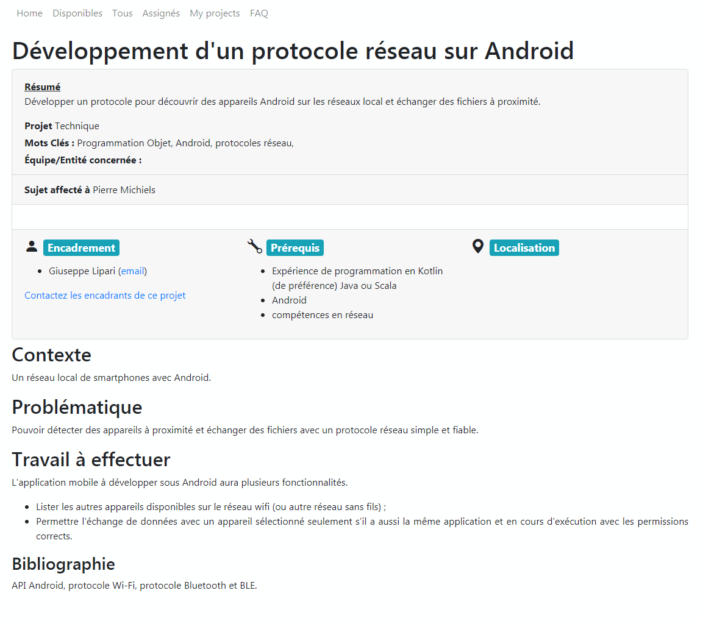

# PFE - WiFi Share App

Dans le cadre du projet de fin d'étude de février 2022, l'application WiFi Share app est une version pour Android d'AirDrop.

Cette application a été développé sous Android Studio Bumblebee | 2021.1.1 Patch 1
 
## Installation

- en mode debug, via android studio.
Après avoir ouvert android studio, dézippez le fichier "WifiShareApp-version de soumission.rar".
Avant de sélectionner le dossier dézippé, supprimez les dossiers ".gradle" et ".idea". Ils vont se re-créer au moment de l'import d'android studio.

- En installant directement l'app (fichier Wifi-share-app.apk) sur le smartphone. (Auparavant, permettre l'installation d'apps de sources inconnues.)

## Tests
- Le fichier "Serveur.java" est un serveur qui permet d'émuler le comportement d'un smartphone qui à l'application en cours d'exécution. Une fois lancé, il permet de répondre à la recherche LAN, de reçevoir des messages ainsi que des fichiers d'un smartphone que a l'application en cours d'exécution.

## Infos

Auteur : Pierre Michiels - Master 2 Cloud Computing - Février 2022
